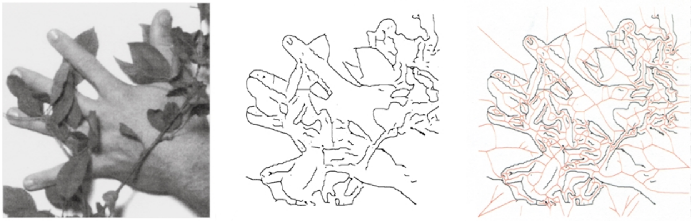

# symmap
Reproducing symmetry maps from Tek &amp; Kimia (2003) [Symmetry Maps of Free-Form Curve Segments via Wave Propagation](https://doi.org/10.1023/A:1023753317008) (presented at ICCV 1999)

Specifically I want to reproduce figure 5 (parts c-e), below

The algorithm for computing the medial axis transform is outlined in detail
[here](https://stackoverflow.com/a/52796778/2668831), and is implemented
in `scikit-image` as
[`skimage.morphology.medial_axis`](http://scikit-image.org/docs/dev/api/skimage.morphology.html#skimage.morphology.medial_axis)
(as well as 
[`skimage.morphology.skeletonize`](http://scikit-image.org/docs/dev/api/skimage.morphology.html#skeletonize)).

## Usage

Run `scan_hand` to reproduce and display (WIP)
