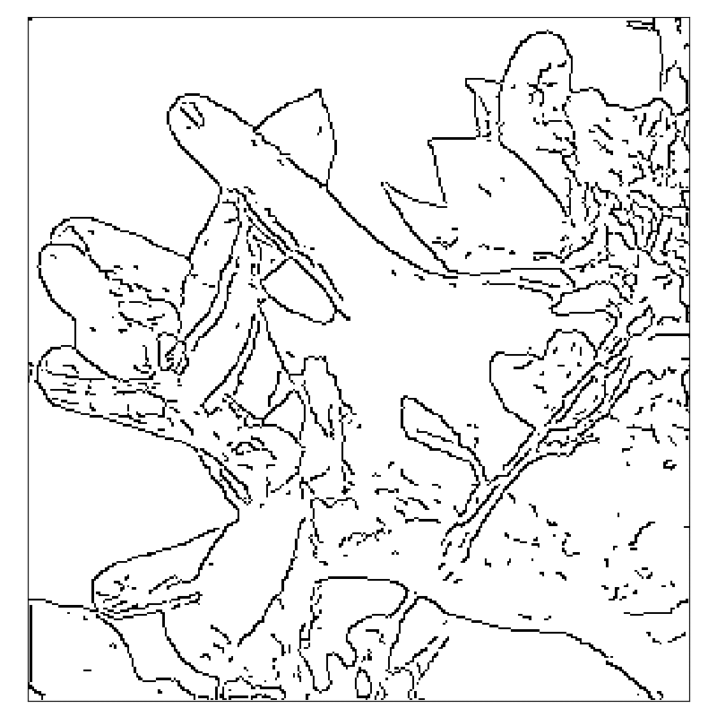

# symmap
Reproducing symmetry maps from Tek &amp; Kimia (2003) [Symmetry Maps of Free-Form Curve Segments via Wave Propagation](https://doi.org/10.1023/A:1023753317008) (presented at ICCV 1999)

Specifically I want to reproduce figure 5 (parts c-e), below


The algorithm for computing the medial axis transform is outlined in detail
[here](https://stackoverflow.com/a/52796778/2668831), and is implemented
in `scikit-image` as
[`skimage.morphology.medial_axis`](http://scikit-image.org/docs/dev/api/skimage.morphology.html#skimage.morphology.medial_axis)
(as well as 
[`skimage.morphology.skeletonize`](http://scikit-image.org/docs/dev/api/skimage.morphology.html#skeletonize)).

## Reproducing the edge map

`auto_canny` did not work well, and I'm pretty sure that using a smaller image gave better results.

Running `reproduce_edge_map()` does the following:

- Resize the image to a smaller size (300wx310h).
  - This produces decimal values (there's an interpolation step) so normalise to
    0-255 and convert back to uint8 (needed for OpenCV's Canny edge detector).
- Save a range of upper bounds for Canny edge detection (trial and error testing showed a lower bound
  of 60-100 was good) and produce an animation cycling through them to visualise what change they produce.

```py
im = read_image('../img/tek-kimia-03-hand-hi-contrast.png', grey=True, uint8=True)
imsml = resize(im, (310, 300), anti_aliasing=True)
imsml = np.uint8(imsml * (255/np.max(imsml)))
for n in np.arange(200,520,20):
    save_image(np.invert(Canny(imsml, 100, n)), (8,8), f'../img/canny/hand-edge-100-{n}.png')
call(['convert', '-delay', '2', '../img/canny/hand-edge-*.png', '../img/canny/hand-edge-100-anim.gif'])
```



The question next becomes how to determine the edge map closest to that in the original paper.

- Firstly, we must crop the box matplotlib put around the edge map
  - From inspecting the box, it seems the border is a black pixel line with a grey pixel either side, so
    incrementing the rmin/cmin and decrementing rmax/cmax by 3 from the usual formula of
    `image[rmin:rmax+1, cmin:cmax+1]` gives a formula of `image[rmin+3:rmax-2, cmin+3:cmax-2]`.

```py
hand200 = read_image('../img/canny/hand-edge-100-200.png', grey=True, uint8=True)
hand_edged = read_image('../img/tek-kimia-03_hand-edged.png', grey=True, uint8=True)
a, b, c, d = bbox(np.invert(hand200)) # note that these values are reusable
hand200crop = hand200[a+3:b-2, c+3:d-2]
```

Now the 2 images must be scaled to the same size, so as to compare their edges. Doing so in desktop editing
software shows it's possible, but not immediately clear how to proceed.


## Usage

Run `scan_hand` to reproduce and display (WIP)
